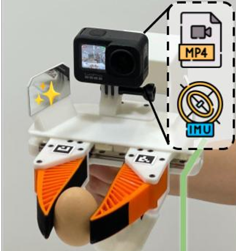
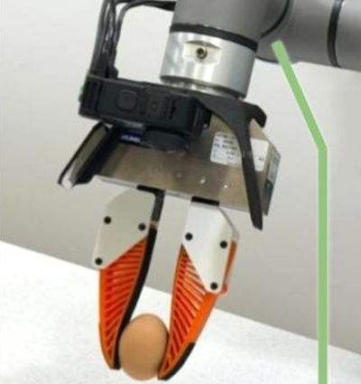
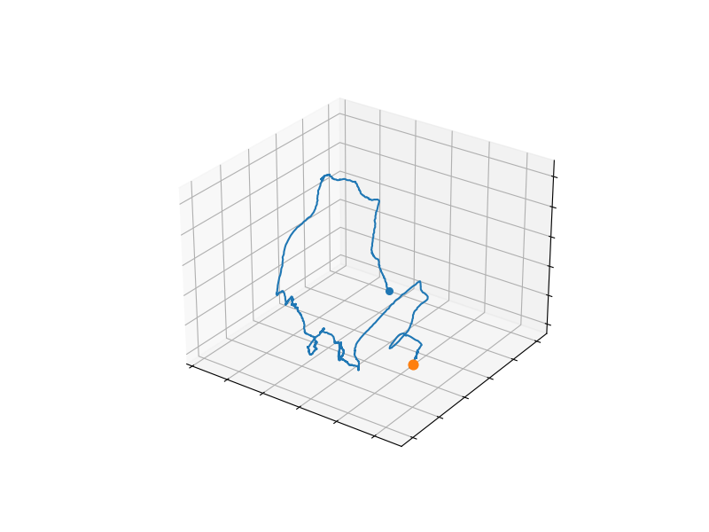
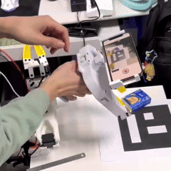
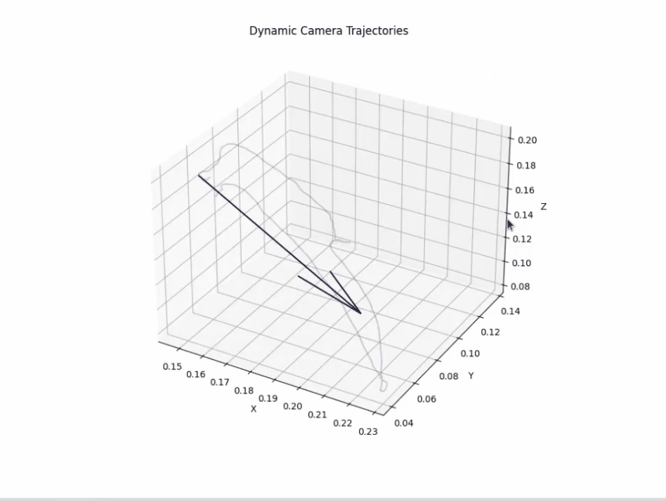
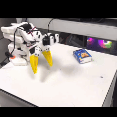
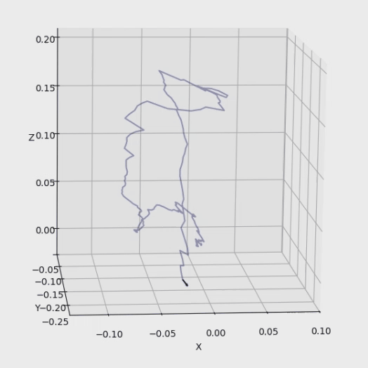

# EasyUMI-Ego

**English** · [简体中文](README.zh-CN.md)

**Embodied intelligence data collection framework** — optimizing **UMI** and **egocentric (wearable)** capture–to–alignment workflows, with a static project page for sharing.

---

## Contents

- [Overview](#overview)
- [Background and motivation](#background-and-motivation)
- [Visual demos](#visual-demos)
- [Focus areas](#focus-areas)
- [Highlights](#highlights)
- [Use cases](#use-cases)
- [License](#license)

---

## Overview

This project improves two embodied data routes — **UMI** and **EGO** — across **cost**, **robot compatibility**, and **data usability**, so useful robot-learning data and tooling are reachable on **consumer-grade hardware**.

Outputs aim to support **multiple robot arms and training stacks** with a **standardized, reproducible** engineering story. (Implementation details are released over time; this README stays at the project level.)

For the full interactive layout and language toggle, open the **[live site](https://joeland4.github.io/EasyUMI-Ego/)**.

---

## Background and motivation

### UMI and the homogeneity bottleneck

Many **UMI-style** deployments assume **homogeneous hardware**: the **robot gripper** should closely match the **handheld UMI gripper** used during teaching. That reduces the embodiment gap but is **burdensome** in practice—labs with **different jaw geometries**, vendors, or custom tools must repeat mechanical alignment work, which **blocks quick reuse across grippers**.

- **UMI (Universal Manipulation Interface)**
  - Official site: [umi-gripper.github.io](https://umi-gripper.github.io/)
  - Paper: [arXiv:2402.10329](https://arxiv.org/abs/2402.10329)
  - Code: [real-stanford/universal_manipulation_interface](https://github.com/real-stanford/universal_manipulation_interface)

**Figure — original UMI homogeneity:** **Left:** handheld UMI gripper used for **in-the-wild teaching / capture**. **Right:** robot-mounted gripper for **policy rollout**—engineered to **match the teaching hardware** so the pipeline stays **isomorphic** (same geometry, camera rig, and contact behavior).

<table style="width:100%;max-width:760px;margin:12px auto;border-collapse:separate;border-spacing:14px;table-layout:fixed;">
  <tbody>
    <tr>
      <td align="center" valign="top" style="width:50%;padding:0;">
        
<b>Teaching capture (handheld UMI gripper)</b>

        
      </td>
      <td align="center" valign="top" style="width:50%;padding:0;">
        
<b>Robot deployment (matched gripper)</b>

        
      </td>
    </tr>
  </tbody>
</table>

### Egocentric open data, trajectory quality, and EgoMimic

Open **ego-centric** human datasets are attractive for scale, yet **trajectory visualization** against a fixed robot frame often reveals **limited geometric precision**; **faithful migration to a specific embodiment** therefore remains hard without extra bridging signals.

- **EgoMimic**
  - Project site: [egomimic.github.io](https://egomimic.github.io/)
  - Paper: [arXiv:2410.24221](https://arxiv.org/abs/2410.24221)

**EgoMimic** shows that **additional collected data**—aligning **ego arm motion** with a **single target manipulator**—is still needed to close the gap between wearable human demos and deployable policies.

  

### Beyond headcount: quality under Gen-1–era scaling

Recent **Gen-1**-class embodied foundation models highlight a strong **scaling law** on **pure egocentric** corpora. That trend implies **ego data is not “more hours only”**—**alignment accuracy, contact/pose fidelity, and embodiment consistency** (i.e., **data quality**) are first-class levers alongside dataset size.

---

## Visual demos

> Preview **UMI** and **Ego (chest-mounted phone → SO101)** GIFs below. For simulation, LeRobot visualization, and more clips, see the [live site](https://joeland4.github.io/EasyUMI-Ego/).

<strong>UMI → SO101</strong>

<table align="center" style="width:100%;max-width:520px;margin-left:auto;margin-right:auto;border-collapse:separate;border-spacing:0 16px;">
  <tbody>
    <tr>
      <td align="center" style="padding:0;text-align:center;">
        
<b>Acquisition</b>

        

          
        

      </td>
    </tr>
    <tr>
      <td align="center" style="padding:0;text-align:center;">
        
<b>Pose / coordinates</b>

        

          
        

      </td>
    </tr>
    <tr>
      <td align="center" style="padding:0;text-align:center;">
        
<b>Real robot</b>

        

          
        

      </td>
    </tr>
  </tbody>
</table>

<strong>Ego → SO101</strong>

<table align="center" style="width:100%;max-width:520px;margin-left:auto;margin-right:auto;border-collapse:separate;border-spacing:0 16px;">
  <tbody>
    <tr>
      <td align="center" style="padding:0;text-align:center;">
        
<b>Acquisition</b>

        

          
        

      </td>
    </tr>
    <tr>
      <td align="center" style="padding:0;text-align:center;">
        
<b>Pose / coordinates</b>

        

          
        

      </td>
    </tr>
    <tr>
      <td align="center" style="padding:0;text-align:center;">
        
<b>Real robot</b>

        

          
        

      </td>
    </tr>
  </tbody>
</table>

---

## Focus areas

| Area | Description |
|------|-------------|
| **Dual pipelines** | Covers **UMI** and **EGO** styles with heterogeneous alignment and a unified presentation |
| **Generalization** | Less tied to one arm or one stack — easier to extend and reuse |
| **Cost & access** | Favors **consumer devices** and lightweight engineering paths |
| **Ecosystem fit** | Plays well with common robot-learning and simulation tooling |

---

## Highlights

- **Low cost** — no reliance on expensive bespoke capture rigs; good for research and prototypes  
- **Broad applicability** — one mindset can cover many arms and task setups  
- **Standardization** — clear structure for collaboration and reproduction  
- **Easy to skim** — static page + visuals for quick orientation  
- **Collaboration-friendly** — layout and code organized for teams and community input  

---

## Use cases

- Embodied **imitation learning**  
- Manipulator **policy training** and data prep  
- Experiments in open stacks such as **LeRobot**  
- **Low-cost, larger-scale** robot data pilots  
- **Cross-arm transfer and generalization** explorations  

---

## License

Fully **open source** — to lower the barrier to embodied data collection and robot-learning work.

- **License:** [MIT License](./LICENSE)  
- Issues and PRs welcome  

---

**EasyUMI-Ego** — heterogeneous alignment for UMI & egocentric capture and presentation.
